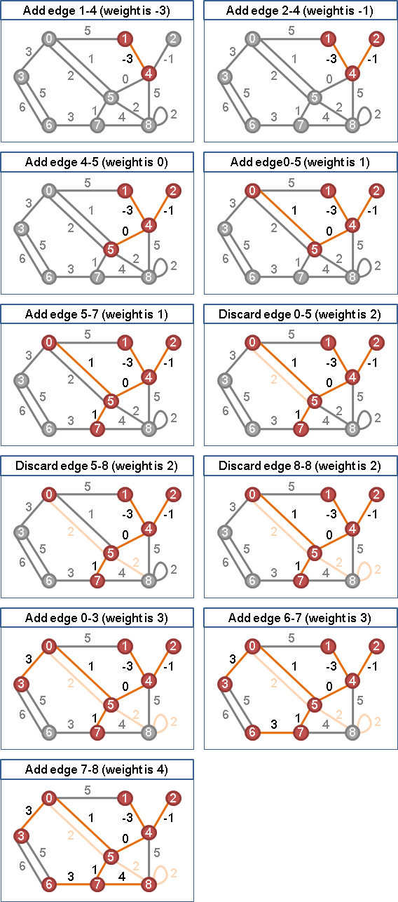

% 上机练习解答
% chyx111@qq.com

# 题型

1000. A．Beautiful Sort 排序
1001. B．Merry Christmas 栈、队列
1002. C．Get High 排序，边界情况的处理
1003. D．A*B Problem 大整数乘法
1004. E．GCD and LCM 数论
1005. F．Snowy Roads 最小生成树
1006. G．Cannon $5 \times 5$的棋盘，问组多能放多少个炮，使其互不受攻击。深搜
1007. H．Play Game 组合博弈，DP，四维
1008. I．Minimize the Maximum 最小化最大值，二分+贪心判断
1009. J．Simple Calculator 表达式计算，没有优先级，直接从左往右计算就行

# 1004 E．GCD and LCM 数论

给出G，L，问有多少对$(x,y,z)$满足$lcm(x,y,z) = L$，$gcd(x, y, z) = G$

将数字用$\prod p_i ^{a_i}$的形式表示出来

# 1005 F．Snowy Roads 最小生成树

[Kruskal's Algorithm](http://www.csie.ntnu.edu.tw/~u91029/SpanningTree.html)

一、两棵MST，要合并成一棵MST时，以两棵MST之间权重最小的边进行连结，当然会是最好的

二、三棵MST，要合并成一棵MST时，先连结其中两棵连结权重最小的MST，然后才连结第三棵，总是比较好

三、一个单独的点，可以视作一棵MST

由以上三点，可以归纳出一个贪心算法：以权重最小的边连结各棵MST，一定比较好

. . .

一、一开始图上每一个点，各自是一棵最小生成子树MST。

二、图上所有边，依照权重大小，由小到大排序。

三、依序尝试图上所有边，作为最小生成树（森林）上的边：

  1. 两端点分别位于两棵MST，也就是产生了桥：用这条边连接两棵MST，合并成一棵MST。这条边会是最小生成树（森林）上的边
  2. 两端点皆位于同一棵MST，也就是产生了环：舍弃这条边。

# 1005 F．Snowy Roads 并查集

[并查集](http://en.wikipedia.org/wiki/Disjoint-set_data_structure)

~~~
 function MakeSet(x)
     x.parent := x

 function Find(x)
     if x.parent == x
        return x
     else
        return Find(x.parent)

 function Union(x, y)
     xRoot := Find(x)
     yRoot := Find(y)
     xRoot.parent := yRoot
~~~

. . .

~~~
function Union(x, y)
   if rand() % 2 == 0
      Swap(x, y)
   xRoot := Find(x)
   yRoot := Find(y)
   xRoot.parent := yRoot
~~~

~~~
 function Union(x, y)
     xRoot := Find(x)
     yRoot := Find(y)
     if xRoot == yRoot
         return

     // x and y are not already in same set. Merge them.
     if xRoot.rank < yRoot.rank
         xRoot.parent := yRoot
     else if xRoot.rank > yRoot.rank
         yRoot.parent := xRoot
     else
         yRoot.parent := xRoot
         xRoot.rank := xRoot.rank + 1
~~~
