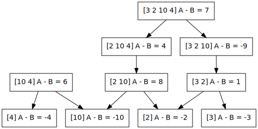

% 算法分析习题选讲(第一章)
% chyx111@qq.com

# 1020 Big Integer    题目大意

输入     输出      要计算的内容
----     --------  ------------------------
4        1 1 3 6    $13 \equiv 1 \pmod 2$
2 3 5 7             $13 \equiv 1 \pmod 3$
13                  $13 \equiv 3 \pmod 5$
                    $13 \equiv 6 \pmod 7$
（样例二）

# 1020 Big Integer    对一个大整数求模

解法一：推公式

$12345678901234567890 \equiv ? \pmod m$

. . .

12345678901234567890 % m

. . .

12345 % m  = (1234 * 10 + 5) % m    = (1234 % m * 10 + 5) % m
---------  -----------------------  ---------------------------
1234 % m   = (123 * 10 + 4) % m     = (123 % m * 10 + 4) % m
123 % m    = (12 * 10 + 3) % m      = (12 % m * 10 + 3) % m
12 % m     = (1 * 10 + 2) % m       = (1 % m * 10 + 2) % m

# 1020 Big Integer    对一个大整数求模

解法二：模拟算式除法

# 1020 Big Integer    代码

~~~ {.cpp}
int GetRemainder(string input, int m) {
  int res = 0;
  for (int i = 0; i < input.size(); ++i) {
    res = (res * 10 + (input[i] - '0')) % m;
  }
  return res;
}
~~~

# 1020 Big Integer    附加练习

准备一份大整数的模板，支持加减乘除操作。

# 1021 Couple   题目大意

N对夫妇站成一圈，如果某对夫妇站在相邻位置，则从圈中移走，问最后能不能把人全部移走。

~~~
1 - 2 - 3
|       |
8       4
|       |
7 - 6 - 5

1 4
2 3
5 6
7 8
~~~

# 1021 Couple   转化问题

把每对夫妇用1-N的整数表示。

~~~
1 - 2 - 2
|       |
4       1
|       |
4 - 3 - 3
~~~

任选一对夫妇，如1，可以发现，如果要移除他们，则必须满足条件：

他们两侧的夫妇都可以单独移掉

于是可以把环随意拆解成一条链：

1 2 2 1 3 3 4 4

# 1021 Couple   用栈来解决

* []........1 2 2 1 3 3 4 4
* [1].........2 2 1 3 3 4 4
* [1,2].........2 1 3 3 4 4
* [1,2,2].........1 3 3 4 4
* [1,x,x].........1 3 3 4 4
* [1].............1 3 3 4 4
* [1,1].............3 3 4 4
* [x,x].............3 3 4 4
* []................3 3 4 4
* [3].................3 4 4
* [3,3].................4 4
* []....................4 4
* [4].....................4
* [4,4]
* []

成功！

# 1021 Couple   用栈来解决

失败的例子：

* []        1 2 1 2
* [1]         2 1 2
* [1,2]         1 2
* [1,2,1]         2
* [1,2,1,2]


# 1021 Couple   代码
~~~ {.cpp}
stack<int> st;
for (int i = 0; i < n + n; ++i) {
  if (!st.empty() && st.top() == couple_id[i]) {
    st.pop();
  } else {
    st.push(couple_id[i]);
  }
}
puts(st.empty() ? "Yes" : "No");
~~~

类似问题：括号匹配问题

# 1027 MJ, Nowhere to Hide    题目大意

~~~
8
inkfish 192.168.29.24
zhi 192.168.29.235
magicpig 192.168.50.170
pegasus 192.168.29.235
iamcs 202.116.77.131
finalBob 192.168.29.24
tomek 202.116.77.131
magicduck 192.168.50.170
4
mmmmmm 172.16.72.126
kkkkkk 192.168.49.161
llllll 192.168.49.161
nnnnnn 172.16.72.126
0
~~~

给出N对BBS ID和IP Address，求出IP Address相同的BBS ID。

# 1027 MJ, Nowhere to Hide    按IP地址分类

                                                                                inkfish 192.168.29.24
---------------------    -----------------------  --------------------------   ---------------------------
                         zhi 192.168.29.235
                                                    magicpig 192.168.50.170
                         pegasus 192.168.29.235
iamcs 202.116.77.131
                                                                                finalBob 192.168.29.24
tomek 202.116.77.131
                                                    magicduck 192.168.50.170

# 1027 MJ, Nowhere to Hide    代码

~~~{.cpp}
map<string, vector<string> > record;
map<string, string> majia;
for (int i = 0; i < n; ++i) {
  string ip, id;
  cin >> id >> ip;
  record[ip].push_back(id);
  if (record[ip].size() == 2) {
    majia[record[ip][0]] = record[ip][1];
  }
}
for (map<string, string>::iterator it = majia.begin(); it != majia.end(); ++it) {
  ...
}
~~~

. . .

此题是多组数据，输出答案时题目要求每个数据后要输出空行，如果最后少一个空行会得到Presentation Error！

虽然答案可能正确，但是考试遇到这种情况是按答案错误来计分的

# 1035 DNA matching   题目大意

给定n $(n \le 100)$ 条DNA单链，求最多能产生多少条DNA双链

其中每条单链只能使用一次

两条单链能组成一双链当且仅当这牠们长度相同，并且对应位置上为A/T, G/C的配对

. . .

ATTCGAC 和 TAAGCTG 能组成双链

```
ATTCGAC
|||||||
TAAGCTG
```

但 CAGCTTA 和 TAAGCTG 就不可以

```
CAGCTTA
   |
TAAGCTG
```

# 1035 DNA matching   匹配问题？

[任意图的最大匹配](http://en.wikipedia.org/wiki/Edmonds%27s_matching_algorithm)，复杂度$O(|E||V|^{1/2})$

# 1035 DNA matching   贪心

发现每条单链最多只能与一种单链匹配，$O(N^2)$

~~~{.cpp}
for (int i = 0; i < N; i++) if (!visit[i]) {
  for (int j = i + 1; j < N; j++) if (!visit[j]) {
    if (match(dna[i], dna[j])) {
      ans++;
      visit[i] = visit[j] = true;
      break;
    }
  }
}
~~~

# 1046 Plane Spotting   题目大意

* Craig喜欢为飞机拍照
* 飞机的出现序列为$p_i$(表示第i时间内出现了多少飞机)
* Craig希望在这个序列中选取连续的一段，即子序列，希望：

 1. 子序列平均值越大越好
 2. 如果平均值一样，则长度大的子序列好
 3. 如果长度也一样，则结束位置靠前的子序列好

# 1046 Plane Spotting   用结构体表示一个子序列

重写比较操作<

对所有可能的子序列进行排序。

~~~{.cpp}
struct Period {
  double average_planes;
  int length, last_position;
};

bool operator<(const Period& a, const Period& b) {
  if (abs(a.average_planes - b.average_planes) > 1e-6) {
    return a.average_planes > b.average_planes;
  }
  if (a.length != b.length) return a.length > b.length;
  if (a.last_position != b.last_position) {
    return a.last_position < b.last_position;
  }
}
~~~

# 1046 Plane Spotting   枚举并排序所有的合法区间
~~~{.cpp}
int num_period = 0;
for (int i = 0; i < n; ++i) {
  int num_planes = 0;
  for (int j = i; j < n; ++j) {
    num_planes += quarter[j];
    int num_quarters = j - i + 1;
    if (num_quarters >= min_size) {
      period[num_period].average_planes = num_planes * 1.0 / num_quarters;
      period[num_period].length = num_quarters;
      period[num_period].last_position = j;
      ++num_period;
    }
  }
}
sort(period, period + num_period);
~~~

# 1051 Biker's Trip Odomete   题目大意

diameter revolutions time

车前轮的直径 转圈数 时间

求车行走的路程和平均速度

# 1051 Biker's Trip Odomete   解法

车轮周长 = $\pi$ 直径

路程 = 周长 $\times$ 转圈数

平均速度 = 路程 / 时间

# 1198 Substring    题目大意

用N个字符串拼成一个新的字符串

要求新字符串字典序最小

. . .

如：a ac ab
则答案为：aabac

# 1198 Substring    字典序

a < b

abca < abcc

a < ab


# 1198 Substring    解法一：贪心

先对N个字符串按字典序排序

后从小到大拼在一起


如：a ac ab 排序后就是 a ab ac

最后的字符串即是 aabac

又如：b ac bd abc 排序后是 abc ac b bd

最后的字符串即是 abcacbbd

. . .

<h1>错误！</h1>

# 1198 Substring    解法一：贪心 反例？

先对N个字符串按字典序排序

后从小到大拼在一起

. . .

b ba

bba?

bab!


# 1198 Substring    真・解法一：枚举

N $\le$ 8, 8! = 40320

KISS = Keep It Simple and Stupid

直接枚举所有8！种组合，从中找最优的

正确性：所有方案都枚举了，所以绝对正确

效率：8! * 100 * 8 = 32032000 可以应付


# 1198 Substring    真・解法一：枚举 代码

用DFS的方法枚举8!个排列？

直接用STL中的next_permutation更方便！

~~~{.cpp}
#include <algorithm>
string sub[8];
void Solve() {
  sort(sub, sub + n);
  do {
    string total;
    for (int i = 0; i < n; ++i) {
      total += sub[i];
    }
    ans = min(ans, total);
  } while(std::next_permutation(sub, sub + n));
}
~~~

# 1198 Substring    解法二：排序

将比较函数

~~~{.cpp}
bool cmp(string a, string b) {
  return a < b;
}
~~~

修正为：

~~~{.cpp}
bool cmp(string a, string b) {
  return a + b < b + a;
}
~~~

证明提示：

证明比较函数的传递性：

a $\le_{cmp}$ b && b $\le_{cmp}$ c

\iff ab $\le$ ba && bc $\le$ cb

\implies ac $\le$ ca

\iff a $\le_{cmp}$ c

# 1176 Two Ends   题目大意

n个正整数排成一列，A和B轮流取数，只能取两端的数，最后取到的数的和较大的人胜利，A和B之间的差为分值

A可以自由选择策略，B的策略是每次都取两端中较大的数，如果相等则取左边的数

. . .

问A赢B的分值最大为多少。

n $\le$ 1000, n为偶数

# 1176 Two Ends   题目大意



# 1176 Two Ends   搜索

~~~{.cpp}
int rec(int left, int right) {
  if (right == left) return -arr[left];

  if ((right - left + 1) % 2 == 1) {  // B's turn
    if (arr[left] < arr[right]) {
      return rec(left, right - 1) - arr[right];
    } else {
      return rec(left + 1, right) - arr[left];
    }
  } else {  // A's turn
    return max(rec(left, right - 1) + arr[right],
        rec(left + 1, right) + arr[left]);
  }
}
~~~
指数级算法

# 1176 Two Ends   动态规划(记忆化搜索)

~~~{.cpp}
int rec(int left, int right) {
  if (right == left) return -arr[left];
  if (done[left][right]) return ans[left][right];

  if ((right - left + 1) % 2 == 1) {  // B's turn
    if (arr[left] < arr[right]) {
      ans[left][right] = rec(left, right - 1) - arr[right];
    } else {
      ans[left][right] = rec(left + 1, right) - arr[left];
    }
  } else {  // A's turn
    ans[left][right] = max(rec(left, right - 1) + arr[right],
        rec(left + 1, right) + arr[left]);
  }
  done[left][right] = true;
  return ans[left][right] = max(ans_left,ans_right);
}
~~~

加了个简单的优化，但效果显著，复杂度降到了$O(n^2)$


