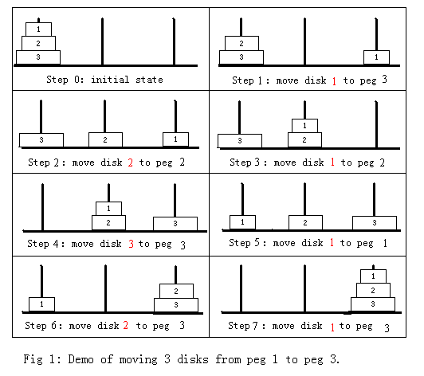
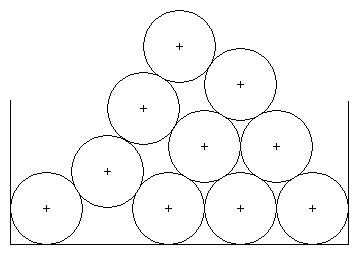
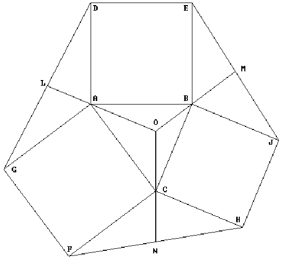

% 算法分析习题选讲(第三章)
% chyx111@qq.com

# 1152 1153 马周游

##  1152 1153 马周游    题目大意

一个有限大小的棋盘上有一只马

给出初始时马的位置，找出一条马移动的路线，经过所有格子各一次

##  1152 1153 马周游    题目大意

--- -----     ---- -----   ------ ------   ----- -----
1     2        3   **4**       5     6       7      8
9     10       11    12       13    14       15    16
17    18       19    20       21    22       23    24
25    26       27    28       29    30       31    32
33    34       35    36       37    38       39    40
41    42       43    44       45    46       47    48
49    50       51    52       53    54       55    56
57    58       59    60       61    62       63    64
--- -----     ---- -----   ------ ------   ----- -----

##  1152 1153 马周游    题目大意

--- -----     ---- -----   ------- ------   ----- -----
1     2        3   **4**       5     6       7      8
9     10       11    12       13    14       15    16
17    18       19    20    **21**    22       23    24
25    26       27    28       29    30       31    32
33    34       35    36       37    38       39    40
41    42       43    44       45    46       47    48
49    50       51    52       53    54       55    56
57    58       59    60       61    62       63    64
--- -----     ---- -----   ------- ------   ----- -----

##  1152 1153 马周游    题目大意

--- -----     ---- -----   ------- ------   ----- -----
1     2        3   **4**       5   **6**     7      8
9     10       11    12       13    14       15    16
17    18       19    20    **21**    22       23    24
25    26       27    28       29    30       31    32
33    34       35    36       37    38       39    40
41    42       43    44       45    46       47    48
49    50       51    52       53    54       55    56
57    58       59    60       61    62       63    64
--- -----     ---- -----   ------- ------   ----- -----

##  1152 1153 马周游    解题思路

* 深搜

* 枚举马能走的所有路径，直至找到一条完成周游的路径

* 回溯

##  1152 1153 马周游    代码

~~~{.cpp}
bool Solve(int x, int depth) {
  route[depth] = x + 1;
  if (depth == m * n - 1) {
    print_route();
    return true;
  }
  visit[x] = true;

  //搜索对效率要求较高，建议将这里换成int children[8]以提高效率。
  vector<int> children;

  get_children(x, &children);
  for (int i = 0; i < children.size(); ++i) {
    if (Solve(children[i], depth + 1)) return true;
  }

  visit[x] = false;
  return false;
}

void get_children(int x, vector<int> *children) {
  for (int i = 0; i < neighbors[x].size(); ++i) {
    int child = neighbors[x][i];
    if (!visit[child]) {
      children->push_back(child);
    }
  }
}
~~~

##  1152 1153 马周游    缺点

程序过慢，只能勉强过1152

. . .

优化：改变搜索顺序

先搜索可行格较少的格子

----- ----- ------ ----- -----
x      .      x      x     x
x      x      x      .     .
.       x    ?(2)     x     x
**x**   x      x      .     .
x       .    ?(1)    x    x 
----- ----- ------ ----- -----

##  1152 1153 马周游    代码
~~~{.cpp}
int cnt_size[64];

bool cmp(int x, int y) {
  return cnt_size[x] < cnt_size[y];
}

int get_children_size(int x) {
  int size = 0;
  for (int i = 0; i < neighbors[x].size(); ++i) {
    int child = neighbors[x][i];
    if (!visit[child]) {
      ++size;
    }
  }
  return size;
}

void get_children(int x, vector<int> *children) {
  for (int i = 0; i < neighbors[x].size(); ++i) {
    int child = neighbors[x][i];
    if (!visit[child]) {
      children->push_back(child);
      cnt_size[child] = get_children_size(child);
    }
  }
  sort(children->begin(), children->end(), cmp);
}
~~~

##  1152 1153 马周游    解题报告

* 可在解题报告中尝试其他搜索顺序或剪枝，对比其效果

* 通过加大数据范围，如扩展到9x9, 10x10，本地跑程序来对比不同算法的性能

* 可以思考构造性的算法

# 1093 Air Express

## 1093 Air Express   题目大意

给出4个重量区间 & 每个区间的单位重量运输价格

Package weight           Cost per pound
---------------------- -----------------
0 to 9 pounds             $10
10 to 49 pounds         $5
50 to 99 pounds         $3
100 pounds or more      $2

有一个背包需要运输，问往背包里面添加多少重量后可以让运费最低

## 1093 Air Express   解题思路

Package weight           Cost per pound
---------------------- -----------------
0 to 9 pounds             $10
10 to 49 pounds         $5
50 to 99 pounds         $3
100 pounds or more      $2

最小运输价格必定出现在：

1. 不添加任何重量
2. 添加重量后刚好到达某个区间的下界

## 1093 Air Express   代码

~~~{.cpp}
int cal(int weight) {
  int price = INF;
  for (int i = 0; i < 4; i++) {
    if (lower[i] <= weight && weight <= upper[i]) {
      price = min(price, weigth * rate[i]);
    } else if (weight < lower[i]) {
      price = min(price, lower[i] * rate[i]);
    }
  }
  return price;
}
~~~

. . .

修改这段代码让它输出需要添加的重量

# 1134 积木分发

## 1134 积木分发    题目大意

n个小伙伴，每个人手上有$a_i$块积木，还需要$b_i$块积木才能完成任务

The Pancakes手上有s块积木，她可以把她手中的积木都给某个人，等那个人完成任务后回收他手上的所有积木

问The Pancakes最后是否能回收完所有人的积木

$s \le 10^6, n \le 10^4, a, b \le 10^9$

## 1134 积木分发    样例

第一个样例：

n = 2, s = 2

a = 1, b = 4

a = 2, b = 1

分给第二个人 -> s = 4 -> 再分给第一个人 -> s = 5

. . .

第二个样例：

n = 2, s = 2

a = 1, b = 4

a = 1, b = 1

分给第二个人 -> s = 3 -> 第一人仍然不够，失败

## 1134 积木分发    解题思路

应该先分给需求少的人，因为分完后The Pancakes手上的积木总是会变多的

. . .

排序后贪心求解

## 1134 积木分发    代码

~~~{.cpp}
struct Node {
  int have, need;
};
bool operator<(const Node& x, const Node& y) {
  return x.need < y.need;
}
bool Solve() {
  sort(nodes, nodes + n);
  for (int i = 0; i < n; i++) {
    if (s < nodes[i].need) return false;
    s += nodes[i].have;
  }
  return true;
}
~~~

# 1140 国王的遗产

## 1140 国王的遗产    题目大意

一棵由n块金块组成的树

k个人按顺序轮流拿金块，每个人拿的时候选择树的一条边将其分割成两棵树

 

## 1140 国王的遗产    题目大意

 

拿的那部分的金块数不能超过当前金块总数的一半

每个人都希望拿到尽量多的金块

如果有多种拿法，则拿最小金块编号最小的那一块

## 1140 国王的遗产    题目大意

 

## 1140 国王的遗产    题目大意

~~~
6 3
1 2
2 3
3 4
2 5
3 6

3 1 2
~~~

$n \le 30000, k \le 100$

## 1140 国王的遗产    解题思路

按顺序做，枚举每一个人，检查切断每一条边所得到的两棵子树，计算其节点数和最小编号

如何得到这两棵子树？

. . .

去掉边后做DFS

复杂度？

. . .

$O(N^2 K)$, 枚举边 * DFS求大小 * K次，无法承受

## 1140 国王的遗产    解题思路

转化成有根树，只需要做一次DFS

 

## 1140 国王的遗产    代码

记录子树的大小，删除的边的两个端点，子树中的最小编号

~~~{.cpp}
struct SubTree {
  int num_nodes;
  int insider, outsider;
  int min_id;
};
~~~

用vector<int>来保存树的边

~~~{.cpp}
const int kMaxN = 31000;
vector<int> G[kMaxN];
SubTree subtree[kMaxN];
~~~

## 1140 国王的遗产    代码

不同子树之间的比较：

~~~{.cpp}
bool operator<(const SubTree& a, const SubTree& b) {
  if (a.num_nodes != b.num_nodes) {
    return a.num_nodes > b.num_nodes;
  }
  return a.min_id < b.min_id;
}
~~~

主过程：

~~~{.cpp}
vector<int> ans;
pivot = 0;
total = n;
for (int ichild = 0; ichild < num_children - 1; ++ichild) {
  pivot = dfs_find_min(pivot, -1);

  best.num_nodes = -1;
  dfs(pivot, -1);
  ans.push_back(best.num_nodes);

  // Remove edge best.insider <-> best.outsider

  total -= best.num_nodes;
  pivot = best.outsider;
}
~~~

## 1140 国王的遗产    代码

找出树中的最小编号，从该编号开始DFS

~~~{.cpp}
int dfs_find_min(int x, int parent) {
  int min_id = x;
  for (int i = 0; i < G[x].size(); ++i) {
    int child = G[x][i];
    if (child == parent) continue;
    min_id = min(min_id, dfs_find_min(child, x));
  }
  return min_id;
}
~~~

## 1140 国王的遗产    代码

主DFS过程

~~~{.cpp}
int total;
int pivot;
SubTree best;
void dfs(int x, int parent) {
  subtree[x].num_nodes = 1;
  subtree[x].min_id = x;
  for (int i = 0; i < G[x].size(); ++i) {
    int child = G[x][i];
    if (child == parent) continue;
    dfs(child, x);
    subtree[x].num_nodes += subtree[child].num_nodes;
    subtree[x].min_id = min(subtree[x].min_id, subtree[child].min_id);
  }
  if (x != pivot) {
    subtree[x].outsider = parent;
    subtree[x].insider = x;
    if (subtree[x].num_nodes <= total / 2) {
      best = min(best, subtree[x]);
    }
    SubTree subtree2;
    subtree2.num_nodes = total - subtree[x].num_nodes;
    subtree2.min_id = pivot;
    subtree2.insider = parent;
    subtree2.outsider = x;
    if (subtree2.num_nodes <= total / 2) {
      best = min(best, subtree2);
    }
  }
}
~~~

# 1438 Shopaholic

## 1438 Shopaholic    题目大意

买东西 每买三件东西 最便宜的一件免费

给出n个需要买的东西

问最多免费多少？

$n \le 20000, price \le 20000$

## 1438 Shopaholic    样例

6

400 100 200 350 300 250

(400 350 300) (250 200 100) => 400

## 1438 Shopaholic    解题思路

尽量使价格高的东西免费

. . .

按价格从高到低排序，每三件取一件免费

. . .

严格证明？考虑最便宜的商品，必须找两个和它配对

~~~{.cpp}
sort(price, price + n, greater<int>());
for (int i = 2; i < n; i += 3) {
  saved += price[i];
}
~~~

# 1028 Hanoi Tower Sequence

## 1028 Hanoi Tower Sequence    题目大意

汉诺塔：三个柱子和大小两两不同的盘子放在一个柱子上

目的：将这些盘子移动到另外一个柱子上

规则：每次只能移动最顶端的一个盘子，每次移动后较小的盘子必须放在较大的盘子上面

. . .

现在给出步数p，问第p步移动的盘子的大小

$p \le 10^{100}$

## 1028 Hanoi Tower Sequence    题目大意

1. 把前n - 1个盘子移到第二根柱子上
2. 把第n个盘子移到第三根柱子上
3. 把前n - 1个盘子移到第三根柱子上

## 1028 Hanoi Tower Sequence    解题思路

先递归求解总步数

设移动k个盘子需要f(k)步，则有：

f(k) = f(k - 1) + 1 + f(k - 1)

f(1) = 1

所以：

. . .

$f(k) = 2^k - 1$

## 1028 Hanoi Tower Sequence    解题思路

发现：

第$2^k$步移动的是第k + 1个盘子

## 1028 Hanoi Tower Sequence    解题思路

找规律

~~~
1
1 2 1
1 2 1 3 1 2 1
1 2 1 3 1 2 1 4 1 2 1 3 1 2 1
1 2 1 3 1 2 1 4 1 2 1 3 1 2 1 5 1 2 1 3 1 2 1 4 1 2 1 3 1 2 1 
~~~

具有自相似的特性

. . .

~~~
0001 => 0
0010 => 1
0011 => 0
0100 => 2
0101 => 0
0110 => 1
0111 => 0
1000 => 3
1001 => 0
1010 => 1
1011 => 0
1100 => 2
1101 => 0
1110 => 1
1111 => 0
~~~

## 1028 Hanoi Tower Sequence    解题思路

答案为把p表示成2进制数，最后有多少个零，再加1

假设x是读进来的数字，x[n - 1]是最低位：

~~~{.cpp}
int ans = 1;
while (x[n - 1] % 2 == 0) {
  ++ans;

  // 除2
  int remain = 0;
  for (int i = 0; i < n; ++i) {
    remain = remain * 10 + x[i];
    x[i] = remain / 2;
    remain %= 2;
  }
  assert(remain == 0);
}
~~~

# 1029 Rabbit

## 1029 Rabbit    题目大意

开始有一对成年兔子

每对成年兔子每个月产生一对小兔子

每只小兔子经过m个月变成成年兔子

问经过d个月后有多少兔子

$1 \le m \le 10, 1 \le d \le 100$

## 1029 Rabbit    题目大意

m = 2时是经典的Fibonacci问题

## 1029 Rabbit    解题思路

每个月的兔子数量 = 上个月兔子数量 + 这个月出生的小兔子数量

. . .

小兔子由大兔子生育得到，这些大兔子在m个月前就必须存在了

每个月的兔子数量 = 上个月兔子数量 + m个月前的兔子数量

~~~{.cpp}
dp[n] = dp[n - 1] + dp[n - m]
~~~

## 1029 Rabbit    代码

~~~{.cpp}
struct BigInteger {
  static const int kMaxLen = 100;
  int x[kMaxLen];
  BigInteger(int a = 0) {
    memset(x, 0, sizeof (x));
    x[0] = a;
  }
};

// 效率较低，只做演示用！
BigInteger operator+(const BigInteger& a, const BigInteger& b) {
  BigInteger c;
  for (int i = 0; i < kMaxLen - 1; ++i) {
    c.x[i] += a.x[i] + b.x[i];
    c.x[i + 1] += c.x[i] / 10;
    c.x[i] %= 10;
  }
  return c;
}

dp[0] = BigInteger(1);
for (int i = 1; i <= d; ++i) {
  if (i < m) {
    a[i] = a[i - 1] + BigInteger(1);
  } else {
    a[i] = a[i - 1] + a[i - m];
  }
}
~~~

# 1381 a*b

## 1381 a*b   题目大意

给两个整数a和b，求$a \times b$

$0 \le a \le 10^{100}, 0 \le b \le 10000$

a, b都有可能是0

## 1381 a*b   解题思路

高精度乘法，模拟竖式乘法

输出时注意前导0和0的情况

## 1381 a*b   代码

~~~{.cpp}
struct BigInteger {
  static const int kMaxLen = 120;
  int x[kMaxLen];
  BigInteger(int a = 0) {
    memset(x, 0, sizeof (x));
    x[0] = a;
  }
  BigInteger operator*(int b) const {
    BigInteger res(0);
    for (int i = 0; i < kMaxLen; i++) {
      res.x[i] += x[i] * b;
      res.x[i + 1] += c.x[i] / 10;
      res.x[i] %= 10;
    }
    return res;
  }
};
~~~

以此为基础，可自行练习大整数乘大整数的程序。

另外，这两个大整数程序都以10为进位，
实际使用时可以用10000为进位数，把4个数字压在一个数组中，可以明显提高程序效率。

# 1206 1012 Stacking Cylinders

## 1206 1012 Stacking Cylinders   题目大意

给出最底层的n个圆柱的位置，求最顶层的圆柱的位置

圆柱半径都为1

$1 \le n \le 10$

## 1206 1012 Stacking Cylinders   解题思路

已知两个圆的圆心坐标，求放在这两个圆上的圆的圆心坐标

向量 勾股定理

## 1206 1012 Stacking Cylinders   complex库

STL中的复数库可以简化代码

复数的旋转：$a \times e^{i \theta}$

两个点之间的距离：$\|a - b\|$

~~~{.cpp}
complex<double> a, b;
b = a * exp(complex<double>(0, t));  //旋转角度为t
b = a * complex<double>(0, 1);  //旋转90度
sqrt(norm(a - b));  // 两点之间的距离
abs(a - b);  // 或者
a.real();  // x坐标
a.imag();  // y坐标
~~~

## 1206 1012 Stacking Cylinders   代码

~~~{.cpp}
typedef complex<double> Point;

bool cmp(const Point& a, const Point& b) {
  return a.real() < b.real();
}

Point Calculate(const Point& a, const Point& b) {
  Point mid = (a + b) / Point(2, 0);
  Point height = (b - mid) * Point(0, 1);
  double len = sqrt(4 - norm(a - mid));
  height = height / abs(height) * len;
  return mid + height;
}

sort(points, points + n, cmp);
for (int len = n - 1; len >= 1; --len) {
  for (int i = 0; i < len; ++i) {
    points[i] = Calculate(points[i], points[i + 1]);
  }
}
~~~

# 1172 Queens, Knights and Pawns

## 1172 Queens, Knights and Pawns    题目大意

给一个棋盘，若干后、马和兵的位置

求棋盘上有多个没被占领的格子不会受到后也不会受到马的攻击

棋盘大小$1000 \times 1000$，每种棋子最多100个

## 1172 Queens, Knights and Pawns    解题思路

用二维数组表示一个棋盘

标记每个棋子的位置

再标记每个棋子能攻击的位置

最后计算有多少个位置不会被攻击

## 1172 Queens, Knights and Pawns    代码

~~~{.cpp}
enum GridState {
  empty,
  occupied,
  attacked
};

const int kMaxN = 1024;
GridState grid[kMaxN][kMaxN];

void occupy(vector<Point> v) {
  for (int i = 0; i < v.size(); i++) {
    grid[v[i].x][v[i].y]] = occupied;
  }
}

bool in_board_and_unoccupied(Point p) {
  if (1 <= p.x && p.x <= num_row) {
    if (1 <= p.y && p.y <= num_col) {
      return grid[p.x][p.y]!=occupied;
    }
  }
  return false;
}
~~~

## 1172 Queens, Knights and Pawns    代码

~~~{.cpp}

int dKnight[8][2] = {{1,2},{1,-2},{2,-1},{-2,-1},{-1,-2},{-1,2},{-2,1},{2,1}};
int dQueen[8][2] = {{1,0},{1,-1},{0,-1},{-1,-1},{-1,0},{-1,1},{0,1},{1,1}};

void KnightAttack(vector<Point> points) {
  for (int i = 0; i < points.size(); i++) {
    for (int dir = 0; dir < 8; dir++) {
      Point newp(points[i].x + dKnight[dir][0], points[i].y + dKnight[dir][1]);
      if (in_board_and_unoccupied(newp)) {
        grid[newp.x][newp.y] = attacked;
      }
    }
  }
}

void QueenAttack(vector<Point> points) {
  for (int i = 0; i < points.size(); i++) {
    for (int dir = 0; dir < 8; dir++) {
      Point newp(points[i].x + dQueen[dir][0], points[i].y + dQueen[dir][1]);
      while (in_board_and_unoccupied(newp)) {
        grid[newp.x][newp.y] = attacked;
        newp(newp.x + dQueen[dir][0], newp + dQueen[dir][1]);
      }
    }
  }
}

~~~

## 1172 Queens, Knights and Pawns    代码

~~~{.cpp}
memset(grid, 0, sizeof(grid));
occupy(queen);
occupy(knight);
occupy(pawn);

KnightAttack(knight);
QueenAttack(queen);

int ans = 0;
for (int i = 1; i <= num_row; i++) {
  for (int j = 1; j <= num_col; j++) {
    if (grid[i][j] == empty) {
      ans++;
    }
  }
}
~~~

# 1034 Forest

## 1034 Forest    题目大意

n个节点

m条有向边

判断是否组成森林，如果是，求出它的最大深度和最大宽度

$n, m \le 100$

## 1034 Forest    解题思路

有根树，边的方向已经确定

. . .

判断是否为森林：

* 没有一个节点的入度超过1
* 计算深度值时没有出现矛盾
* 没有环

具体做法：

入度为0的点都做DFS，为每个点计算深度，判断最后是否所有的点都被访问到

## 1034 Forest    代码

~~~{.cpp}
const int kMaxN = 128;
vector<int> G[kMaxN];
int depth[kMaxN];  // -1: invalid
int count_depth[kMaxN];
int indegree[kMaxN];

bool dfs(int x, int parent, int d) {
  depth[x] = d;
  ++count_depth[d];
  for (int i = 0; i < G[x].size(); ++i) {
    int child = G[x][i];
    if (child == parent) continue;
    if (depth[child] != -1) return false;
    if (!dfs(child, x, d + 1)) {
      return false;
    }
  }
  return true;
}
~~~

~~~{.cpp}
memset(depth, -1, sizeof (depth));  // only the value -1, 0 can be memseted
memset(count_depth, 0, sizeof (count_depth));
bool is_forest = true;
for (int i = 0; i < n; ++i) {
  if (indegree[i] == 0) {
    if (!dfs(i, -1, 0)) {
      is_forest = false;
      break;
    }
  } else if (indegree[i] != 1) {
    is_forest = false;
    break;
  }
}
for (int i = 0; i < n; ++i) if (depth[i] < 0) {
  is_forest = false;
}
~~~

# 1193 Up the Stairs

## 1193 Up the Stairs   题目大意

N个人在F层之间搬箱子

开始时每个人都位于某一层上，要么手头拿着箱子，要么没有

拿着箱子的人会往上走，没拿的会往下走

当两个人相遇时，拿着箱子的人会把箱子交给没有箱子的人，互换方向继续走

走到F层的人把箱子放下，走到0层的人把箱子拿起来

初始时，0层有B个箱子，问多少时间后，所有箱子都在F层

. . .

\| 0, B boxes | 1 | 2 | ... | $\blacksquare \rightarrow$ | ... | $\leftarrow \Box$ | ... | F-1 | F |

\| 0, B boxes | 1 | 2 | ... | $\leftarrow \Box$ | ... | $\blacksquare \rightarrow$ | ... | F-1 | F |

$1 \le N, F \le 1000, 1 \le B \le 10^6$

## 1193 Up the Stairs   解题思路

两个人交换箱子互换方向，相当于互相穿过没有交换

经过2F时间后，所有人的状态是没有改变的

. . .

很容易计算经过t时间后，每个人搬了多少箱子

## 1193 Up the Stairs   代码
~~~
int n, num_floor, base;
bool can_finish(int t) {
  int moved = 0;
  for (int i = 0; i < n; ++i) {
    int time2 = t;
    if (person[i].state == 0) {
      time2 += num_floor - person[i].x;
    } else {
      --moved;
      time2 += num_floor + person[i].x;
    }
    moved += time2 / (2 * num_floor);
  }
  return moved >= base;
}
~~~

## 1193 Up the Stairs   解题思路

反过来如何计算？

二分答案，设经过t时间后可以完成任务

~~~
int lo = 0, hi = 2 * base * num_floor;
while (lo != hi) {
  int mid = lo + (hi - lo) / 2;
  if (can_finish(mid)) {
    hi = mid;
  } else {
    lo = mid + 1;
  }
}
printf("%d\n", lo);
~~~

# 1004 I Conduit!
## 1004 I Conduit!    题目大意

二维坐标平面上有n条边，如果两条边有重叠部分，则可以合并成一条边

问合并后的边的数量

$n \le 10^4$ 坐标范围 [0.0, 1000.0]

# 1017 Rate of Return

## 1017 Rate of Return   题目大意

Jill在某些月份会进行投资，这些投资额在每个月都会带来一定的利润

现在给出Jill某个月份结束后的本金和利润之和，求利润率

~~~
2
1 100.00
3 100.00
4 210.00
~~~

例如，1月份和3月份分别投资100，4月底得到210，设利润率为x，则有方程：

$100 (1+x)^4 + 100 (1+x)^2 = 210$

解得：

$x = 0.01635$

## 1017 Rate of Return   解题思路

利润率越高，本金和利润之和越大，所以$100 (1+x)^4 + 100 (1+x)^2$是一个单调函数，可以二分查找函数的零点

## 1017 Rate of Return   代码

~~~
double lo = 0, hi = 1;
for (int loop = 0; loop < 100; ++loop) {
  double mid = (lo + hi) / 2;
  double sum = 0;
  for (int i = 0; i < n; ++i) {
    sum += amount[i] * pow(1 + mid, month[n] - month[i] + 1);
  }
  if (sum < amount[n]) {
    lo = mid;  // 提高下界
  } else {
    hi = mid;  // 缩小上界
  }
}
~~~

# 1059 Exocenter of a Triangle

## 1059 Exocenter of a Triangle   题目大意

已知A，B，C，求O

## 1059 Exocenter of a Triangle   向量的旋转

~~~
* exp(Point(0, pi / 2))
~~~

## 1059 Exocenter of a Triangle   两点确定直线

~~~
void PointPointToLine(Point p1, Point p2, double *a, double *b, double *c) {
  // a x + b y + c = 0
  // a (x1 - x2) + b (y1 - y2) = 0
  *a = imag(p1 - p2);
  *b = -real(p1 - p2);
  // (y1 - y2) x1 - (x1 - x2) y1 + c = 0
  // -x1 y2 + x2 y1 + c = 0
  // c = x1 y2 - x2 y1 叉乘
  *c = imag(conj(p1) * p2);
}
~~~

## 1059 Exocenter of a Triangle   两直线求交点

~~~
Point intersect(Point p1, Point p2, Point p3, Point p4) {
  double a1, b1, c1;
  double a2, b2, c2;
  PointPointToLine(p1, p2, &a1, &b1, &c1);
  PointPointToLine(p3, p4, &a2, &b2, &c2);

  double x = imag(conj(Point(b1, c1)) * Point(b2, c2));
  double y = imag(conj(Point(c1, a1)) * Point(c2, a2));
  double d = imag(conj(Point(a1, b1)) * Point(a2, b2));
  return Point(x / d, y / d);
}
~~~

## 1059 Exocenter of a Triangle   主过程

~~~
Point d = a + (b - a) * exp(Point(0, M_PI / 2));  // #include <cmath>
Point g = a + (c - a) * exp(Point(0, -M_PI / 2));
Point l = (d + g) / Point(2, 0);

Point e = d + b - a;
Point j = b + (c - b) * exp(Point(0, M_PI / 2));
Point m = (e + j) / Point(2, 0);

Point o = intersect(a, l, b, m);
if (abs(o.real()) < 1e-6) o.real() = 0;
if (abs(o.imag()) < 1e-6) o.imag() = 0;
~~~

# 1003 Hit or Miss

## 1003 Hit or Miss    题目大意

n个人，第一个人开始时以一定顺序拿着标有1到13各4张的卡片堆

每个人分别执行以下两个步骤：

1. 如果手上有卡，每次轮到自己则数一个数，从1开始，在1~13内循环，如果数的数刚好和自己的卡片堆最顶的卡片一样，则丢弃这张卡片，否则把这张卡片放到卡片堆底
2. 除了第1个人，如果每个人前面的一个人有卡片丢弃，则把丢弃的卡片放到自己卡片堆底

如此循环，直到每个人手上都没有卡片，或不能终止

如果可以结束，则输出每个人最后丢弃的卡片

## 1003 Hit or Miss    解题思路

认真阅读题意，按照题意直接模拟

当循环次数超过最大卡片张数（52）仍没有人抛弃卡片，则判断不能终止

## 1003 Hit or Miss    代码
~~~
struct player {
  queue<int> cards;
  int lastcard, count;
  int step1() {
    int discard = -1;
    if (!(cards.empty())) {
      int curr = cards.front();
      cards.pop();
      if (curr == count) {
        lastcard = discard = cur;
      } else {
        cards.push(cur);
      }
      if (count == 13) {
        count = 1;
      } else {
        ++count;
      }
    }
    return discard;
  }
};
~~~

## 1003 Hit or Miss    代码
~~~
void run() {
  int lastround = 0;
  for (int round = 1; round - lastround <= 52; ++round) {
    for (int i = 0; i < n; ++i) {
      discards[i] = person[i].step1();
      if (discards[i] != -1) {
        lastround=round;
      }
    }
    for (int i = 1; i < n; i++) {
      if (discards[i - 1] != -1) {
        person[i].cards.push(discards[i - 1]);
      }
    }
  }
}
~~~

# 1018 A Card Trick

## 1018 A Card Trick   题目大意

一个魔术，助手把五张扑克的其中四张按一定顺序给魔术师，魔术师可能通过一定的规则计算出剩余的一张扑克

给出五张扑克，求出一个前四张牌的顺序，使得魔术师可以猜出第五张牌

1. Remember the suit and value of the first card.
2. Among the remaining three cards find the position of the smallest card (in the above order). Add this position (1, 2, or 3) to the value of the first card.
3. If the larger two of the last three cards are not in order, add 3 to the result of step 2.
4. The missing card has the same suit as the first card and value that computed in step 3 wrapping around if necessary.

QH, 10D, 10C, 4D

Smallest of the last 3 cards is 4D in place 3

10D and 10C are out of order so add 3 + 3 to Q

Q + 3 + 3 = 5 => 5H

## 1018 A Card Trick   解题思路

枚举五张扑克的顺序，找出其中合法的

~~~
bool check() {
  // 假设card[0]是要猜测的card
  if (cards[0].suit != cards[1].suit) {  // rule 4
    return false;
  }
  int result = 0, min_pos = 2, max_pos = 2;
  for (int i = 3; i < 5; ++i) {
    if (cards[i] < cards[min_pos]) min_pos = i;
    if (cards[i] > cards[max_pos]) max_pos = i;
  }
  int middle = 2 ^ 3 ^ 4 ^ min_pos ^ max_pos;
  result += min_pos - 1;  // rule 2
  if (middle > max_pos) {  // rule 3
    result += 3;
  }
  return cards[0].num % 13 == (cards[1].num + result) % 13;
}
~~~

## 1018 A Card Trick   解题思路
~~~
struct Card {
  int num;
  char suit;
};

bool operator< (const Card& a, const Card& b) {
  if (a.num != b.num) {
    return a.num < b.num;
  }
  return a.suit < b.suit;
}
~~~

~~~
sort(cards, cards + 5);
do {
  if (check()) break;
} next_permutation(cards, cards + 5);
~~~

# 1052 Candy Sharing Game

## 1052 Candy Sharing Game    题目大意

M个学生围成一圈，开始时所有学生都有偶数的糖

每个回合，所有学生同时把手里的一半糖传给右边的学生

如果某个学生的糖数为奇数，则老师多给他一个糖

所有学生的糖数目相等时回合结束

求回合数和每个学生手里的糖数

## 1052 Candy Sharing Game    

# 1082 MANAGER

## 1082 MANAGER   题目大意

现在有一个进程序列，每个进程都有消耗

有以下几种操作：
-----  ----------------------------------------------------------------
a x     在序列中放进消耗为x的进程
r       在序列中移除一个进程，根据策略可能是消耗最小或最大的
p i      设定策略
-----  ----------------------------------------------------------------

给出一些输出序号，当执行的移除操作的次数和序号一致时，输出这次移除的进程的消耗

## 1082 MANAGER   题目大意

建立二叉查找树，可以动态进行插入，删除，查找最大/最小值

可以使用stl里的map

记录每次移除的进程消耗，查询时直接输出

## 1082 MANAGER   代码

~~~
void append(int x) {
  process_map[x]++;
}

int remove() {
  if (p == 1){
    it = process_map.begin();
  } else {
    it = process_map.rbegin();
  }
  int x = it->first;
  if (--it->second == 0) {
    process_map.erase(x);
  }
  record[cnt++] = x;
  return x;
}
~~~

