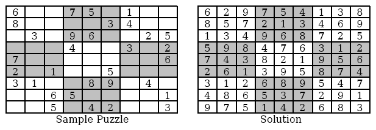
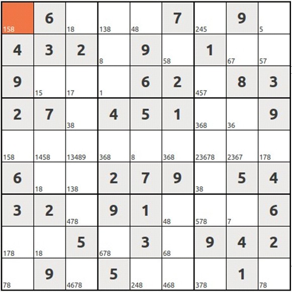

% 算法分析习题选讲(第五章)
% chyx111@qq.com

# 1317 Sudoku
## 1317 Sudoku    题目大意

给出一个未完成的数独，问这个数独有多少个解

## 1317 Sudoku    解题思路

用1-9的数字把空格填满，使得9行，9列以及9个小的3×3方格内都有1~9这9个数字

. . .

深度优先搜索+剪枝

## 1317 Sudoku    暴力搜索

按照格子顺序，枚举每个格子可能出现的数字，如果发现矛盾则回溯，直到找出所有解

. . .

超时

## 1317 Sudoku    剪枝

数独中的技巧

. . .

搜索时，对每个格子，根据同行同列和同小方格已有的数字，判断当前格子可能填上的数字，如果只有一个数字可填，则可以马上填上

仍然超时

## 1317 Sudoku    剪枝2

如果有个数字在某一行某一列某个小方格里面只找到1个位置，则可以马上填上

<http://soj.me/viewsource.php?sid=80678>

## 1317 Sudoku    更强大的算法

<http://en.wikipedia.org/wiki/Dancing_Links>

# 1215 脱离地牢

## 1215 脱离地牢    题目大意

有两个人在一个地牢里，里面有墙壁也有熔浆

当一个人向某个方向移动时，另一个人会向另一个方向移动

如果遇到墙壁则不能前进，如到熔浆则任务失败

问使两个人相遇最少需要多少步

~~~
5 5
#####
#H..#
#.!.#
#.#P#
#####
WNSE
~~~

~~~
Paris行走方案为NNWWS，每步过后Helen位置在(2,2), (2,2), (3,2), (4,2), (3,2)
~~~

## 1215 脱离地牢    解题思路

从初始状态开始进行bfs，状态为两个人分别的位置

转移：

一个人向东南西北四个方向移动，同时另外一个人也跟着移动，到达新状态

<http://soj.me/viewsource.php?sid=87055>

# 1171 The Game of Efil

## 1171 The Game of Efil    题目大意

一块$m \times n$大小的板上，有一些细菌

如果一个细菌的八个方向上邻居细菌数是2或3，则在下一个回合它能保留下来，否则它会消失

如果有一个空格的邻居细菌数为3，则下一回合长出新的细菌

板的上下边是连通的，左右边是连通的 (torus)

给出一个板的当前状态，问上一个回合的状态有多少不同的情况

$m \times n \le 16$

## 1171 The Game of Efil    解题思路

枚举出每种状态，按照规则生成下一步状态，并与输入状态比较，相等则答案数加一

因为最多有16个格子，因此最多有$2^{16}$个状态

二进制暴力枚举所有状态即可。

## 1171 The Game of Efil    代码
~~~{.cpp}
vector<vector<int> > dest(n, vector<int>(m, 0));
vector<vector<int> > curr(n, vector<int>(m, 0));
vector<vector<int> > next_state(n, vector<int>(m, 0));
~~~

~~~{.cpp}
int ans = 0;
for (int msk = (1 << (n * m)) - 1; msk >= 0; --msk) {
  for (int i = 0; i < n; ++i) for (int j = 0; j < m; ++j) {
    if (msk & (1 << (i * m + j))) {
      curr[i][j] = 1;
    } else {
      curr[i][j] = 0;
    }
  }

  for (int i = 0; i < n; ++i) for (int j = 0; j < m; ++j) {
    int sum = 0;
    for (int dx = -1; dx <= 1; ++dx) {
      for (int dy = -1; dy <= 1; ++dy) {
        if (dx == 0 && dy == 0) continue;
        sum += curr[(i + dx + n) % n][(j + dy + m) % m];
      }
    }
    if (curr[i][j] == 1 && (sum == 2 || sum == 3)) {
      next_state[i][j] = 1;  // survive
    } else if (curr[i][j] == 0 && sum == 3) {
      next_state[i][j] = 1;  // birth
    } else {
      next_state[i][j] = 0;
    }
  }

  if (next_state == dest) ++ans;
}
~~~

# 1219 新红黑树

## 1219 新红黑树    题目大意

一棵树由红枝和黑枝组成的树，A和B轮流砍树，A只砍红枝，B只砍黑枝

砍枝后不与根相连的枝都去掉。每个树枝上有权值，砍掉的枝的权值加到自己的分数上

A想使A-B之差越高越好，B想它越低越好。在最佳策略下A-B之差

. . .

树枝树不超过20

## 1219 新红黑树    解题思路

博弈题，可以看作在博弈树上进行深搜，并根据两人的策略取最大值或最小值

博弈状态有重复，状态只包括，当前剩下的树枝，和轮到谁砍树枝

使用记忆化搜索

预处理砍掉每个树枝会使哪些其它树枝消失

## 1219 新红黑树    代码，预处理

~~~{.cpp}
struct Edge {
  int from, to, color, weight;
};
int dfs(int x, int parent) {
  int edges_in_tree = 0;
  for (int i = 0; i < G[x].size(); ++i) {
    int edge_id = G[x][i];
    int to = edges[edge_id].to ^ edges[edge_id].from ^ x;
    if (to == parent) continue;
    int edges_in_subtree = dfs(to, x);

    child_edges[edge_id] = (1 << edge_id) ^ edges_in_subtree;
    edges_in_tree ^= child_edges[edge_id];
  }
  return edges_in_tree;
}
~~~

## 1219 新红黑树    代码，最小最大博弈
~~~{.cpp}
int mem[1 << 20][2];
int min_max(int tree, int player) {  // player = 1 or -1
  if (tree == 0) return 0;
  int &max_difference = mem[tree][(player + 1) / 2];
  if (max_difference != 0xcccccccc) return max_difference;

  for (int cut = 0; cut < num_edges; ++cut) if ((1 << cut) & tree) {
    if (edges[cut].color != player) continue;

    int new_tree = tree & ~child_edges[cut];
    max_difference = max(max_difference, edges[cut].weight - min_max(new_tree, player * -1));
  }
  if (max_difference == 0xcccccccc) {
    max_difference = -min_max(tree, player * -1);
  }
  return max_difference;
}

memset(mem, 0xcc, sizeof (mem));
printf("%d\n", min_max((1 << num_edges) - 1, 1));
~~~

# 1048 Inverso

## 1048 Inverso   题目大意

给出一个$3 \times 3$棋盘，每个格子是黑色或白色

每个格子有一个按钮，按这个按钮会使自己和周围8个方向的格子颜色反转

问最少需要多少步使所有格子变成白色，输出最小的序列

## 1048 Inverso   解题思路

任何一个按钮按两次以上都是没用的，因为按两次的作用互相抵消了

枚举每个格子按或者不按，判断是否能使所有格子变成白色，如果可以，则取所有方案的最小值

## 1048 Inverso   代码
~~~{.cpp}
char ans[10], ans[10];
void dfs(int position, int cnt) {
  if (position > 9) {
    cand[cnt] = 0;
    if (allwhite() && better(cand, ans)) {
      strcpy(ans, cand);
    }
    return;
  }
  // Case 1:
  dfs(position + 1, cnt);
  // Case 2:
  flip(position);
  cand[cnt] = position + '0';
  dfs(position + 1, cnt + 1);
}
~~~

# 1135 飞越原野

## 1135 飞越原野   题目大意

在$m \times n$的平面上，有一个德鲁伊，可以用1的时间向四个方向走一步，
或用1的时间向四个方向飞任意距离

飞行降落点和行走必须在平地上

飞行的总距离有限制。问从(1,1)飞到(m,n)的最短时间。

~~~
4 4 2
PLLP
PPLP
PPPP
PLLP
~~~

## 1135 飞越原野   解题思路

BFS

. . .

状态为当前所在格子坐标(x,y)，当前可用飞行距离d

初始状态 (0, 0, d)
终止状态 (m, n, x)，其中x可以为任意非负整数。

每个状态，可以向四个方向走一步，或向四个方向飞任意距离，都消耗时间1

~~~{.cpp}
struct State {
  int x, y, d, s;
};
queue<State> q;
int dx[4] = {0, 1, 0, -1};
int dy[4] = {1, 0, -1, 0};
~~~

~~~{.cpp}
int bfs() {
  q.push(State(1,1,D,0));
  while (!q.empty()) {
    State curr = q.top(); q.pop();
    if (curr.x == m && curr.y == n) return curr.s;
    for (int k = 0; k < 4; ++k) {
      State new_State = walk(curr, k);
      if (valid(new_State)) q.push(new_State);
      for (int i = 1; i <= curr.d; i++) {
        new_State = fly(curr, k, i);
        if (valid(new_State)) q.push(new_State);
      }
    }
  }
}

State walk(State old, int k) {
  old.x += dx[k];
  old.y += dy[k];
  ++old.s;
  return old;
}

State fly(State old, int k, int step) {
  old.x += dx[k] * step;
  old.y += dy[k] * step;
  old.d -= step;
  ++old.s;
  return old;
}

bool valid(State state) {
  if (state.x < 1 || state.x > m || state.y < 1|| state.y > n) return false;
  if (graph[state.x][state.y] == 'L') return false;
  if (visit[state.x][state.y][state.d]) return false;
  visit[state.x][state.y][state.d]=true;
  return true;
}
~~~

# 1107 Simple Puzzle

## 1107 Simple Puzzle   题目大意

给出n个数，每个数有k个数字，现在把这n个数写成n行，并且对齐成k列

在每个数中擦去一个数字，并且擦去的数字的列要不相同，得到n个不完整的数

现在给出这n个不完整的数和初始n个数的和，求这个n个数

## 1107 Simple Puzzle   解题思路

枚举n个数中每个数缺失的位，并且缺失的位应该填上的数字

然后检查所有数的和是否和输入相等，相等则记下

枚举用dfs

对所有答案排序输出

## 1107 Simple Puzzle   代码
~~~{.cpp}
int dfs(int m) {
  if (m >= n) {
    check();
    return;
  }

  int old_number = numbers[m];
  for (int i = 0; i < k; ++i) {
    if (exist[i]) continue;
    exist[i] = true;
    for (int j = 0; j <= 9; ++j) {
      numbers[m] = add_digit(old_number, i, j);
      dfs(m + 1);
    }
    exist[i] = false;
  }
  numbers[m] = old_number;
}
~~~

~~~{.cpp}
int add_digit(int x, int pos, int digit) {
  int z = __gnu_cxx::power(10, pos);
  int y = x % z;
  x /= z;
  return (x * 10 + digit) * z + y;
}

void check() {
  int sum = 0;
  for (int i = 0; i < n; ++i) {
    sum += numbers[i];
  }
  if (sum == sum_expected) {
    memcpy(ans[cnt], numbers, sizeof(int) * n);
    ++cnt;
  }
}
~~~

