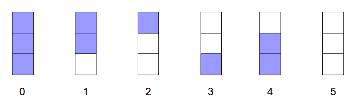
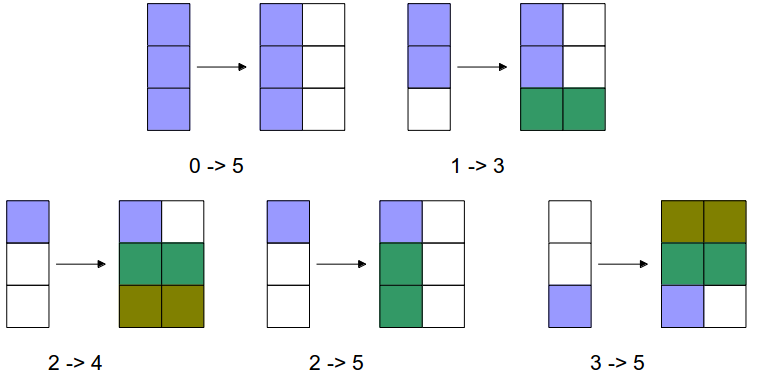
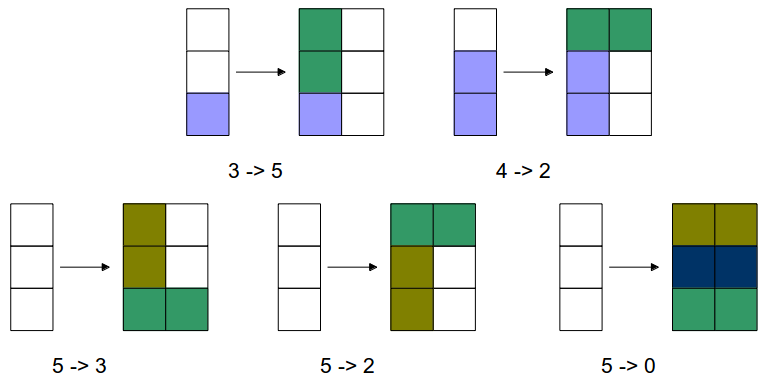

% 算法分析习题选讲(第六章)
% chyx111@qq.com

# 1011 Lenny's Lucky Lotto

## 1011 Lenny's Lucky Lotto   题目大意

给出N和M，问有多少个长度为N的序列，使得每个数的范围都在[1,M]之间，
并且序列中每一个数至少是前一个数的两倍

## 1011 Lenny's Lucky Lotto   解题思路

动态规划

$dp[i][j]$表示考虑前i位且第i位为j的方案

$$
dp[i][j] = \sum_{1 \le k \le \frac{j}{2}} dp[i-1][k]
$$

先枚举位数i，再枚举最后一个数j，最后统计k

时间复杂度$O(N \times M \times M)$

## 1011 Lenny's Lucky Lotto   代码
~~~{.cpp}
for (int j = 1; j <= 2000; ++j) {
  dp[1][j] = 1;
}

for (int i = 2; i <= 10; ++i) {
  for (int j = 1;j <= 2000; ++j) {
    dp[i][j] = 0;
    for (int k = 1; k * 2 <= j; ++k) {
      dp[i][j] += dp[i -1 ][k];
    }
  }
}
~~~

# 1121 Tri Tiling

## 1121 Tri Tiling    题目大意

用$1 \times 2$的长方形铺满$3 \times n$的长方形，有多少种方法

## 1121 Tri Tiling    解题思路

状态转移：

## 1121 Tri Tiling    代码

初始第0列是状态0，终止第n+1列是状态5

~~~{.cpp}
dp[0][0]=1;
for (int i = 1; i <= n + 1; ++i) {
  dp[i][5] += dp[i - 1][0];
  dp[i][3] += dp[i - 1][1];
  dp[i][4] += dp[i - 1][2];
  dp[i][5] += dp[i - 1][2];
  dp[i][1] += dp[i - 1][3];
  dp[i][5] += dp[i - 1][3];
  dp[i][2] += dp[i - 1][4];
  dp[i][3] += dp[i - 1][5];
  dp[i][2] += dp[i - 1][5];
  dp[i][0] += dp[i - 1][5];
}
~~~

# 1264 Atomic Car Race

## 1264 Atomic Car Race   题目大意

在一次赛车比赛中，在检查点换轮胎需要花费一定时间$b$，而速度与离上一次换轮胎的路程相关，
行走越远，速度越低

问从起点到终点的最少时间

## 1264 Atomic Car Race   解题思路

先求出两次换轮胎的地点之前行驶所需要的时间

~~~{.cpp}
for(int i = 0; i < n; ++i){
  int position = stop[i];
  cost[i][i] = 0;
  for (int k = i; k <= n; ++k) {
    if (k > i) cost[i][k] = cost[i][k - 1];
    for (; position < stop[k]; ++position) {
      if (position - stop[i] >= r) {
        cost[i][k] += 1 / (v - e * (position - stop[i] - r));
      } else {
        cost[i][k] += 1 / (v - f * (r - position + stop[i]));
      }
    }
  }
}
~~~

## 1264 Atomic Car Race   用递归的方法进行动态规划

$dp[i][j]$ 表示到达第i个换轮胎点，上一次换轮胎位置是j时的消耗值

初始状态有$dp[1][0], dp[1][1]$

答案为$dp[n][n] - b$（假设在最后一个位置换轮胎，但这一次换轮胎是没必要的）

~~~{.cpp}
dp[1][0] = cost[0][1];
dp[1][1] = dp[1][0] + b;

for (int i = 2; i <= n; ++i) {
  for (int k = 0; k < i; ++k) {
    dp[i][k] = dp[i - 1][k] + cost[k][i] - cost[k][i - 1];
  }
  dp[i][i] = dp[i][0];
  for (int k = 0; k < i; ++k){
    dp[i][i] = min(dp[i][k], dp[i][i]);
  }
  dp[i][i] += b;
}
~~~

# 1828 Minimal

## 1828 Minimal   题目大意

给出两个集合$S_1$，$S_2$

在$S_2$中选出一些不重复的数与$S_1$每个数匹配，使得匹配的数的差的绝对值尽量小

集合中数的个数不超过500

## 1828 Minimal   解题思路

首先证明，在$S_1$中取两个数$a_1$,$b_1$，在$S_2$中取两个数$a_2$,$b_2$

若$a_1<b_1$,$a_2<b_2$，则$|a_1-a_2|+|b_1-b_2|<|a_1-b_2|+|a_2-b_1|$

所以匹配的时候，先假定$S_1$中的数字已经排序，那么可以知道，$S_2$中的数字也是必须排好序的。

## 1828 Minimal   动态规划

$dp[i][j]$表示$S_1$中前i个数与$S_2$中前j个数匹配时，第i个数以及之前的匹配数值差的绝对值之和

~~~{.cpp}
sort(s1, s1 + n);
sort(s2, s2 + m);

dp[0][0] = abs(s1[0] - s2[0]);
for (int i = 1; i < m; ++i) {
  dp[0][i] = min(dp[0][i - 1], abs(s1[0] - s2[i]));
}

for (int i = 1; i < n; ++i) {
  dp[i][i] = dp[i - 1][i - 1] + abs(s1[i] - s2[i]);
  for (int j = i + 1; j < m; ++j) {
    dp[i][j] = min(dp[i][j - 1], dp[i - 1][j - 1] + abs(s1[i] - s2[j]));
  }
}
~~~

# 1527 Tiling a Grid With Dominoes

## 1527 Tiling a Grid With Dominoes    题目大意

用$1 \times 2$的长方形铺满$4 \times N$的长方形，有多少种方法

## 1527 Tiling a Grid With Dominoes    解题思路

和1121一样，找出不同的缺口

用0表示缺口无方块，1表示有

0:0000 1:0011 2:1100 3:1001 4:0110 5:1111

状态转移：0->1, 0->2, 0->3, 0->5, 1->2,  1->0, 2->1, 2->0, 3->0, 3->4, 4->3, 5->0, 0->0

## 1527 Tiling a Grid With Dominoes    代码

~~~{.cpp}
dp[0][0]=1;
for (int i = 1; i <= n + 1; ++i) {
  dp[i][0] += dp[i - 1][0];
  dp[i][1] += dp[i - 1][0];
  dp[i][2] += dp[i - 1][0];
  dp[i][3] += dp[i - 1][0];
  dp[i][5] += dp[i - 1][0];
  dp[i][2] += dp[i - 1][1];
  dp[i][0] += dp[i - 1][1];
  dp[i][1] += dp[i - 1][2];
  dp[i][0] += dp[i - 1][2];
  dp[i][0] += dp[i - 1][3];
  dp[i][4] += dp[i - 1][3];
  dp[i][3] += dp[i - 1][4];
  dp[i][0] += dp[i - 1][5];
}
~~~

# 1148 过河

## 1148 过河   题目大意

桥的起点为0，终点为L，其中地有M个石子

青蛙每次跳的范围为[S,T]，问要跳过桥最小踩到石子次数

$1 \le L \le 10^9$

$1 \le S \le T \le 10$

$1 \le M \le 100$

## 1148 过河   解题思路

L的值大太，直接按L的值进行动态规划不可行

. . .

分情况：若S和T相等，则踩到的石子数是固定的

若S和T不相等，因为S和T的最大值为10，所以当两个石子相差太远是没有意义的，

这里取的值为100，当石子距离相差100以上时，看作100，答案不变。

压缩后桥长度不超过10000，直接动态规划即可

## 1148 过河   代码

~~~{.cpp}
for (int i = 0; i < m; ++i) {
  delta[i] = rock[i + 1] - rock[i];
  if (delta[i] > 100) {
    delta[i] = 100;
  }
}
for (int i = 1; i <= m; ++i) {
  rock[i] = rock[i - 1] + delta[i - 1];
}
for (int i = 1; i <= m; ++i) {
  dp[rock[i]] = 1;
}

can_reach[0] = 1;
L = rock[m] + 100;
for (int i = s; i <= L; ++i) {
  min_touched = 101;
  for (int j = i - t; j <= i - s; ++j) {
    if (j >= 0) {
      if (can_reach[j] && dp[j] + dp[i] < max) {
        min_touched = dp[j] + dp[i];
        can_reach[i] = 1;
      }
    }
  }
  dp[i] = min_touched;
}
~~~

# 1163 Tour

## 1163 Tour    题目大意

有一个人要从起点开始经过所有目的地再回到起点

他只能从起点（最左端的点），向右一直到达最右端的点，再返回起点，在这一次往返要经过所有的点

求最短路程

## 1163 Tour    解题思路

一次往返可以看作从最左端点到最右端点的两条独立路径

对所有点按从左到右排序后，用$dp[i][j]$表示两条路径现在分别在i和j点。

## 1163 Tour    代码

~~~{.cpp}
dp[1][0] = dist[1][0];
for (int i = 2; i < n; ++i) {
  dp[i][0] = dp[i - 1][0] + dist[i][i - 1];
}
for (int j = 1; j < n; ++j) {
  dp[j + 1][j] = dp[j][0] + dist[0][j+1];
  for (int i = 1; i < j; ++i) {
    dp[j + 1][j] = min(dp[j + 1][j], dp[j][i] + dist[i][j + 1]);
  }
  for (int i = j + 2; i < n; ++i) {
    dp[i][j] = dp[i - 1][j] + dist[i][i - 1];
  }
}
~~~

# 1345 能量项链

## 1345 能量项链   题目大意

给出一串项链，每次可以选相邻两个珠子进行聚合，释放出一定的能量，并产生一个新珠子

项链是头尾相接的

求释放的能量的总和的最大值

项链长度不超过100

## 1345 能量项链   例子

设N=4，4颗珠子的头标记与尾标记依次为(2，3) (3，5) (5，10) (10，2)

我们用记号⊕表示两颗珠子的聚合操作，(j⊕ k)表示第j，k两颗珠子聚合后所释放的能量

则第4、1两颗珠子聚合后释放的能量为：

(4⊕ 1)=10 * 2 * 3=60。

这一串项链可以得到最优值的一个聚合顺序所释放的总能量为

((4⊕ 1)⊕ 2)⊕ 3）= 10 * 2 * 3 + 10 * 3 * 5+10 * 5 * 10 = 710

## 1345 能量项链   解题思路

每次聚合，都会使数字中一的个数字消失

动态规划

状态为[i,j]表示从i开始，按顺时针方向到j，这一段珠子所聚合得到的能量最大值

状态转移：要求出[i,j]的值，则存在一个k在i和j之间，
[i,j]的值为[i,k]的值与[k+1,j]的值与这次聚合所释放出的能量的总和，取最大值

. . .

长度较大的区间需要长度较小的区间得到，因此枚举顺序为区间的长度从小到大

## 1345 能量项链   代码
~~~{.cpp}
for (int step = 1; step < n; ++step) {
  for (int i = 0; i < n * 2; ++i) {
    int j = i + step;
    if (j >= n * 2) break;
    for (int k = i; k < j; ++k) {
      int better = dp[i][k] + dp[k + 1][j] + weight[i] * weight[k + 1] * weight[j + 1];
      dp[i][j] = max(dp[i][j], better);
    }
  }
}
~~~

# 1687 Permutation

## 1687 Permutation    题目大意

n个数的排列，可以在中间插入小于号和大于号，如1 3 5 4 2 变成 1<3<5>4>2

现在问n个数其中有k个小于号的排列有多少个

$n, k \le 100$

## 1687 Permutation    解题思路

用$dp[i][j]$表示i个数的排列有j个小于号，现在要扩展到i+1个数的排列，即插入一个数要大于当前所有数

当这个数插入位置为序列头或小于号中间时，排列比原来多出一个大于号

当这个数插入位置为序列尾或大于号中间时，排列比原来多出一个小于号

## 1687 Permutation    解题思路

~~~{.cpp}
for (int i = 1; i < 100; ++i) {
  for (int j = 0; j < i; ++j) {
    dp[i + 1][j] += dp[i][j] * (j + 1);
    dp[i + 1][j] %= 2007;
    dp[i + 1][j + 1] += dp[i][j] * (i - j);
    dp[i + 1][j + 1] % =2007;
  }
}
~~~

