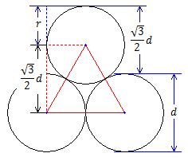

% 周练2（10月12日，3小时）
% chyx111@qq.com

# UVA 101 The Blocks Problem    题意

有N个位置，编号为0～N-1

初始时，各个位置上放置这和位置编号相同的砖块，即砖块1，砖块2，...，砖块N-1

五种命令操作方式：

1. move a onto b：把砖a移动到砖b上面，如果a和b上面都有砖块，要先把它们放回原来位置
2. move a over b：把a移动到有b的“砖堆”上面，移动前需要把a上面的砖块都恢复到原位置，b的堆保持不变
3. pile a onto b：把a之上的（包括a）搬到b之上，要先把b上面的砖放回到原来位置
4. pile a over b：直接把a之上的（包括a）搬到b所在的“砖堆”上
5. quit：结束命令

. . .

--- ---- ---- ---- ---- -----
          3
 0   1    2    _    4     5
--- ---- ---- ---- ---- -----

$n \le 25$

# UVA 101 The Blocks Problem    解法

理解题意

直接用栈模拟

# UVA 102 Ecological Bin Packing

有Brown，Green，Clear三种颜色的杯子

现在有三个盒子，每个盒子中有三种数量不等的杯子

要使每个箱子中只有一种颜色的杯子，求需要移动最小的杯子数目以及之后每个箱中杯子的组成

# UVA 102 Ecological Bin Packing    解法

枚举三个盒子所有可能的最终状态

~~~
BCG
BGC
CBG
CGB
GBC
GCB
~~~

统计每种状态所需要的步数

# UVA 103 Stacking Boxes

给出几个多维的箱子

如果箱子的每一边都小于另一个箱子的对应边，就称这个箱子小于另一个箱子

求箱子套箱子最多能套多少层

# UVA 103 Stacking Boxes   解法

动态规划

dp[i], $1 \le i \le n$

dp[i] = 1 + max{dp[j], box j is inside box i}

~~~{.cpp}
int dp[kMaxN];
int from[kMaxN];

or

pair<int, int> dp[kMaxN];
~~~

# UVA 104 Arbitrage

n种货币

给出n行数据，每行n - 1个数字，表示该种货币与其他n - 1种货币的汇率

现在要在这些货币中找到一种货币，交换最少的次数，使得金额的数量增加（汇率大于1.01），并输出方案

# UVA 104 Arbitrage   解题思路

转化问题，找最短路，使得距离超过1

多解的情况找经过节点最多的路径

# UVA 104 Arbitrage   解题思路

Floyd算法求最短路

~~~{.cpp}
for (int k = 0; k < n; ++k) {
  for (int i = 0; i < n; ++i) {
    for (int j = 0; j < n; ++j) {
      dp[i][j] = dp[i][k] + dp[k][j];
    }
  }
}
~~~

# UVA 104 Arbitrage   伪代码
~~~{.cpp}
best[i][j][s] = 0, for all i,j,s
best[i][j][1] = input for the program
best[i][i][1] = 1, for all i
path[i][j][1] = i, for all i, j

for (int steps = 2; steps <= n; steps++) {
  for (int k = 0; k < n; ++k) {
    for (int i = 0; i < n; ++i) {
      for (int j = 0; j < n; ++j) {
        tmp = best[i][k][steps-1] * best[k][j][1];
        if (tmp > best[i][j][steps]) {
          best[i][j][steps] = tmp;
          path[i][j][steps] = k;
        }
      }
    }
  }
}
~~~

$O(n^4)$

# UVA 105 The Skyline Problem

给定数轴上若干条线段的端点，和这些线段上放置的矩形的高度

求矩形合并后的形状

坐标大小 < 10000

# UVA 105 The Skyline Problem   解法

暴力记录每个位置上面的最高位置

# UVA 114 Simulation Wizardry

模拟弹珠台

模拟题，认真读题，实现每一个细节

. . .

小球碰到障碍物（墙或弹板）时仅会转向（顺时针转向）而不会移动，但无论小球是否移动生命值都要减1，因为每1步都消耗了1个单位的时间，碰到障碍物所减少的生命值另计

小球在移入弹板位置（下一步将被弹回到原位置）前生命值必须为正，否则不能得到分值，因为在移入的这个过程中小球的生命结束了

小球不能停留在任何障碍物的位置上，一旦发生碰撞必须立即回到原位

假设桌面的尺寸为3×3，桌面上就不可能有弹板，因为除了一圈子的墙外只有一格可供小球发射。在这种情况下，小球不会得到任何分值，生命值会在不断的撞墙中消耗殆尽

# UVA 115 Climbing Trees

家谱树 确定两个人是否在一个家谱中存在亲属关系

给定一系列的“子-父”姓名对作为家谱，每对姓名中前者为子，后者为父

给定一系列的待查姓名对，表示两个人的姓名

需要判断对中的两个姓名是否在家谱中是否存在亲属关系

. . .

亲属关系有4种：

1. 子关系 包括孙、曾孙、玄孙等
2. 父关系 包括祖父、曾祖父、高祖父等
3. cousin -- 0^th^ cousin, 1^st^ cousin, 2^nd^ cousin, etc. p和q是cousins当且仅当它们在家谱树中是相连的，
假设p和q的公共祖先是r，它们距离公共祖先的距离分别是n和m，那么p和q是k代cousins，k = min(n, m)
4. 兄弟 即0代cousins

总人数 $\le 300$

# UVA 115 Climbing Trees    解法

查询树中两个节点的最小公共祖先 LCA

做法：

* 暴力 $O(n^2)$
* Tarjan算法 并查集复杂度
* 转化为RMQ $O(n \log n)$
* 构造跳表 $O(n \log n)$

# UVA 117 The Postal Worker Rings Once

中国邮递员问题

邮递员从邮局出发送信，要求对辖区内每条街，都至少通过一次，再回邮局

最多存在两个奇数度的路口，其它所有路口的度均为偶数，即有偶数条街道与该路口相连

. . .

连通的无向图$G$有欧拉路径的充要条件是：$G$中奇顶点（连接的边数量为奇数的顶点）的数目等于0或者2

有两个奇顶点？

用一条路径把两个奇顶点连接起来，用最短路算法求这条路径的长度

# UVA 121 Pipe Fitters

给出一个$a \times b$的矩阵，问最多能放多少个圆柱体，叠放方式只有网格和交错方式两种

. . .

解法：枚举

 ^[http://www.cnblogs.com/devymex/archive/2010/08/15/1799966.html]

# UVA 125 Numbering Paths

在一个所有街道都是单行线的城市中，询问两个点之间可行路径的数量

. . .

解法

a->b的路径条数等于a->i与i->b的路径条数的乘积之和

用Floyd算法：

~~~
for (k = 0; k < n; k ++) {
  for (i = 0; i < n; i ++) {
    for (j = 0; j < n; j ++) {
      if (f[i][k] && f[k][j]) {
        f[i][j] += f[i][k] * f[k][j];
      }
    }
  }
}
~~~

正确性

$\circ^i \rightarrow [ \circ \rightarrow \circ \rightarrow .... \circ ]^{\lt k} \rightarrow \circ^j$
