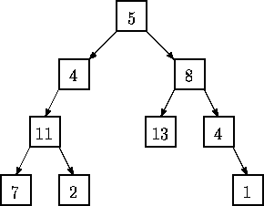

% 周练2（10月19日，4小时）
% chyx111@qq.com

# UVA 106 Fermat vs. Pythagoras

## UVA 106 Fermat vs. Pythagoras   题意

$x, y, z \in N$，给定一个数n，找出所有的$x, y, z \le n$，使得$x^2 + y^2 = z^2$

$n \le 1000000$

## UVA 106 Fermat vs. Pythagoras   解法1 枚举勾股数

直接枚举x, y, 复杂度为$O(n^2)$

. . .

勾股数的另一种表示：

$x = m^2 - n^2, y = 2mn, z = m^2 + n^2$，m，n是任意正整数

## UVA 106 Fermat vs. Pythagoras   解法2 生成勾股数

<http://en.wikipedia.org/wiki/Tree_of_primitive_Pythagorean_triples>

. . .

扩展题目

[ProjectEuler 223 $a^2 + b^2=c^2 + 1$](http://projecteuler.net/problem=223)

[ProjectEuler 224 $a^2 + b^2=c^2 - 1$](http://projecteuler.net/problem=224)

# UVA 107 The Cat in the Hat

## UVA 107 The Cat in the Hat    题意

数学题，理解题意

小猫的帽子里面有N只小小猫，小小猫的高度是小猫的$\frac{1}{N + 1}$

小小猫的帽子里面也有N只小小小猫，依次类推

最后一批小猫的高度是1，数量是n

假设有K代

$(N+1)^K = h$

$N^K = n$

## UVA 107 The Cat in the Hat    解法

从1开始枚举K

或者

. . .

$(N+1)^K = h$

$N^K = n$

$lg(N + 1) / lg(N) = h / n$

二分求解N

# UVA 108 - Maximum Sum

## UVA 108 - Maximum Sum    题意

给一个$N \times N$矩阵，求最大子矩阵和

$N \le 100$

## UVA 108 - Maximum Sum    解法1

$O(N^6) \rightarrow O(N^4)$暴力

## UVA 108 - Maximum Sum    解法2 最大子段和

给定有n个整数(可能为负整数)组成的序列$a_1,a_2,\cdots,a_n$

求该序列连续的子段和的最大值

如果该序列的所有元素都是负整数时定义其最大子段和为0

例如，当$(a_1, a_2, a_3, a_4, a_5)=(-5,11,-4,13,-4-2)$时，
最大子段和为11+(-4)+13=20

. . .

动态规划

已知前n个数的最大子段和，那么前n+1个数的最大子段和有两种情况

* 子段和包含前面的数字
* 只包含第n+1个数

如果包含前面数字，则答案为第n个位置的最优子段和加上第n+1个数字

~~~{.cpp}
int max_sum = 0;
int prev_sum = 0;
for (int i = 0; i < n; ++i) {
  prev_sum = prev_sum + arr[i];
  if (prev_sum < 0) prev_sum = 0;
  max_sum = max(max_sum, prev_sum);
}
~~~

复杂度$O(n)$

## UVA 108 - Maximum Sum    解法2

枚举子矩阵的上下底，再做最大子段和

复杂度$O(n^3)$

# UVA 109 SCUD Busters

## UVA 109 SCUD Busters   题目大意

世界由几个互不重叠领土但彼此敌对的国家组成，每个国家有一个发电站，负责给本国发电

1. 给出每个国家的建筑数（包括发电站和房子数)，每个国家用最少的围墙将本国保护起来（凸包）
2. 现在有不定数量的飞毛腿导弹开始袭击这些国家，给出导弹落地点，落在某国区域内，某国直接玩完，以该国面积为大小的区域不能发电
3. 求出最后所有不能发电区域的总面积

<http://blog.csdn.net/j_dark/article/details/8893234>

## UVA 109 SCUD Busters   解法

求出每个国家的凸包并计算面积——导弹挨个判定在不在凸包内——若在，则累加当前凸包面积

若某国家之前被导弹袭击过，之后再被袭击的话，面积只能算一次

# UVA 110 Meta-Loopless Sorts

## UVA 110 Meta-Loopless Sorts    题目大意

生成一段pascal的排序程序，不允许有循环，递归调用

. . .

生成一段可以枚举所有排列的程序

~~~
begin sort(a, b, c)
  if a < b and b < c return a, b, c
  if a < c and c < b return a, c, b
  if b < a and a < c return b, a, c
  if b < c and c < a return b, c, a
  if c < a and a < b return c, a, b
  if c < b and b < a return c, b, a
end
~~~

# UVA 127 "Accordian" Patience

## UVA 127 "Accordian" Patience   题目大意

<http://my.oschina.net/zenglingfan/blog/148410>

移牌游戏,按以下规则:

1. 从左向右, 考虑每张牌, 若某张牌与其左边第1张或左边第3张是同一个牌号或花色, 则就把这张牌移到左边的匹配牌上方, 并继续向左边移动, 直至左边第1张或第3张都不是符合的牌为止
2. 如果同时有两张以上的牌可以移动, 则总是移动最左边的牌
3. 如果既可以移到左边第1张也可以移到左边第3张, 则总是移到左边第3张上面
4. 如果某一列被移为空, 则把右边的牌合并过来
5. 每次只取一列中最顶上的牌进行比较

当所有牌都不能移动时, 从左到右输出每一列包含的张数

## UVA 127 "Accordian" Patience   解法

1. 使用 list 存放每一列, 再使用 vector 存放所有的列
2. 每次比较时, 在 vector 里从左到右依次取出一列, 比较其最顶的牌与其左边第1张、第3张牌是否为同一分组,若是同一分组, 则按"题意"规则 1, 3 进行移动
3. 注意, 当一张牌移动完毕后, 应该从它移动到的牌的下一张开始重新循环, 而不是移动时的牌的下一张, 否则无法满足"题意"中的规则 2

# UVA 130 Roman Roulette

## UVA 130 Roman Roulette   题目大意

约瑟夫环

有n个囚犯站成一个圆圈，准备处决

首先从一个人开始，越过k-2个人（因为第一个人已经被越过），并杀掉第k个人

接着，再越过k-1个人，并杀掉第k个人

这个过程沿着圆圈一直进行，直到最终只剩下一个人留下，这个人就可以继续活着

问题是，给定了n和k，一开始要站在什么地方才能避免被处决

## UVA 130 Roman Roulette   解法

分析通项公式

本题过程过于复杂，数据量小(小于100人)，可以直接模拟

用vector代表这个环即可

# UVA 111 History Grading

## UVA 111 History Grading    题目大意

有n个事件，每个事件发生的年份都不同

输入n个事件发生的年份，输入学生作答时对于这n个事件的所排的年份

问最长学生排对了几个，不用连续

## UVA 111 History Grading    解题思路

最长公共子序列

动态规划

$$
LCS\left(X_{i},Y_{j}\right) = \begin{cases}   \emptyset & \mbox{ if }\ i = 0 \mbox{ or }  j = 0 \\   \textrm{  } LCS\left(X_{i-1},Y_{j-1}\right) +  1 & \mbox{ if } x_i = y_j \\   \mbox{longest}\left(LCS\left(X_{i},Y_{j-1}\right),LCS\left(X_{i-1},Y_{j}\right)\right) & \mbox{ if } x_i \ne y_j \\ \end{cases} 
$$

$O(n^2)$

# UVA 112 Tree Summing

## UVA 112 Tree Summing   题目大意

确定一个由LISP的S表达式表示的树是否具有一个确定的性质

(5 (4 (11 (7 () ()) (2 () ()) ) ()) (8 (13 () ()) (4 () (1 () ()) ) ) )

## UVA 112 Tree Summing   解法

用DFS或栈把树构造出来即可

